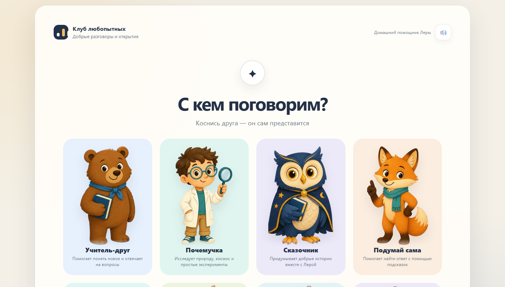
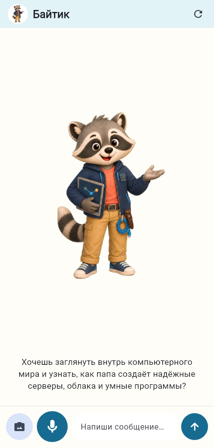
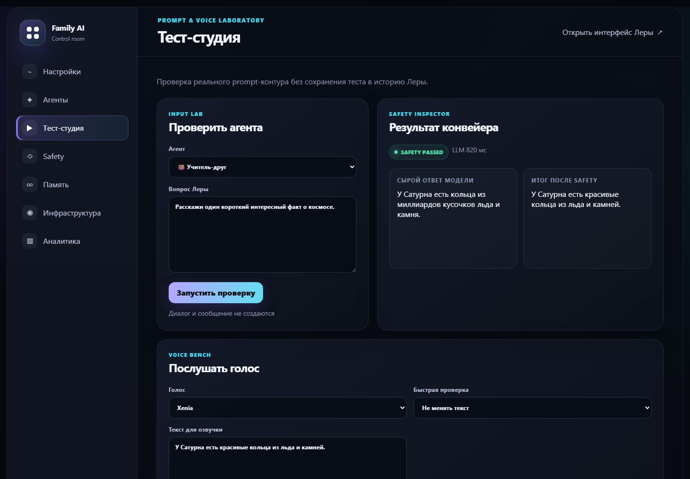
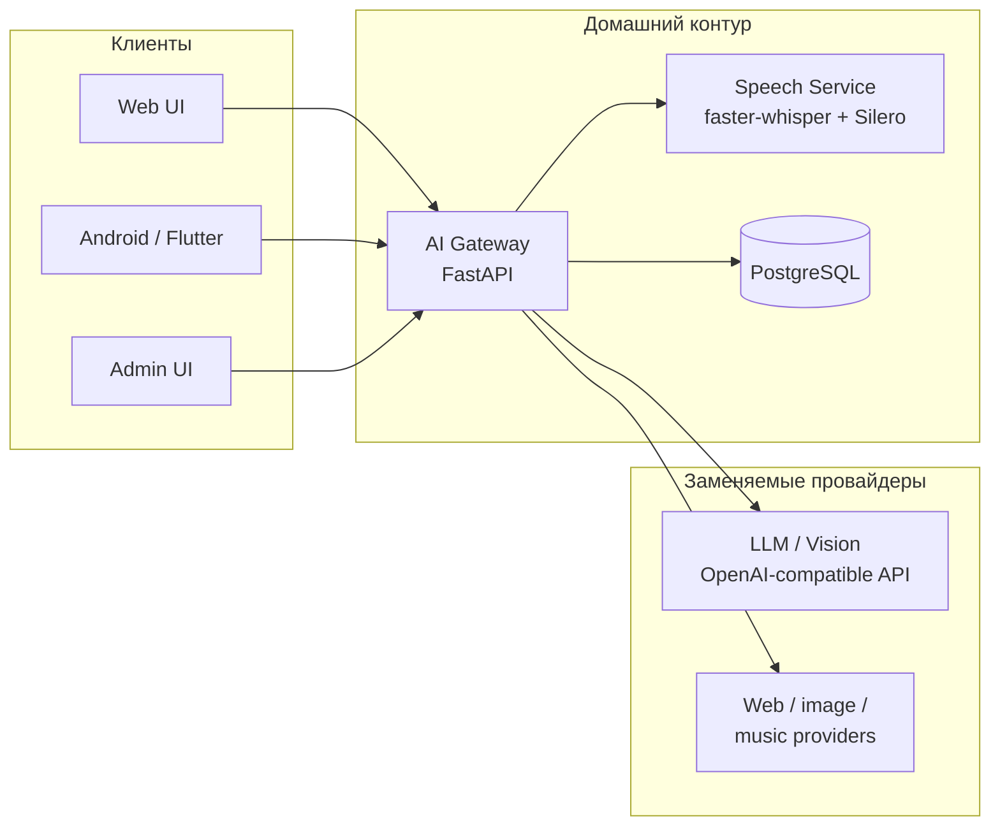

<div align="center">

# Family AI Mentor

**Домашний голосовой AI-наставник, который помогает ребёнку исследовать мир безопасно и с интересом.**

Русскоязычная self-hosted платформа с голосовым и текстовым диалогом,
настраиваемыми персонажами, пониманием фотографий и родительским контролем.

[](https://www.python.org/)
[](https://fastapi.tiangolo.com/)
[](https://flutter.dev/)
[](https://www.postgresql.org/)
[](docs/child-safety-boundaries.md)
[](LICENSE)

<sub>Russian-first by design · Local speech available · Built for a family, structured as a replaceable service platform</sub>

</div>



## Зачем этот проект

Большинство AI-чатов рассчитано на взрослого, умеющего читать, формулировать
запросы и оценивать достоверность ответа. Family AI Mentor решает другую задачу:
даёт ребёнку понятный визуальный интерфейс, живой голосовой диалог и несколько
узких наставников, а родителю — контроль памяти, безопасности и эксплуатации.

Это не замена родителю и не бесконечная развлекательная лента. Платформа
помогает задавать вопросы, проходить короткие занятия и приключения, изучать
природу, технологии, музыку и космос — в пределах правил, подтверждённых
родителем.

## Возможности

| Для ребёнка | Для родителя | Для эксплуатации |
| --- | --- | --- |
| Голосовой и текстовый диалог | Версионные промпты и настройки агентов | Раздельные Gateway, Speech и PostgreSQL |
| Визуальный выбор из 8 наставников | Формальный Safety Policy Engine | Метрики STT, Vision, LLM и TTS |
| Продолжение истории каждого персонажа | Только подтверждённая долгосрочная память | Release passport и redacted diagnostics |
| Короткие голосовые занятия и приключения | Тест-студия без записи в детскую историю | Воспроизводимый deploy, rollback и DR |
| Одноразовый режим «Покажи и спроси» | Аналитика, обратная связь и regression cases | Web, Android и адаптивная Admin UI |
| Повторное прослушивание ответа | Настраиваемые retention и локальный Speech | Visual и release regression gates |

## Интерфейсы

<table>
  <tr>
    <td width="36%" align="center">
      
      <br /><strong>Android-клиент</strong><br />
      <sub>Большие действия, голосовой сценарий и адаптация под клавиатуру.</sub>
    </td>
    <td width="64%" align="center">
      
      <br /><strong>Admin Control Room</strong><br />
      <sub>Проверка prompt, safety и голоса без загрязнения истории ребёнка.</sub>
    </td>
  </tr>
</table>

Ключевые интерфейсы дополнительно закреплены visual regression baselines:
изменения проверяются до релиза, а не только глазами после развёртывания.

## Архитектура



- **AI Gateway** владеет бизнес-логикой, контекстом, safety, инструментами и историей.
- **Speech Service** предоставляет OpenAI-совместимые STT/TTS endpoints и может
  работать полностью локально.
- **PostgreSQL** хранит диалоги, версии агентов, подтверждённую память и
  обезличенную техническую телеметрию.
- **Провайдеры заменяемы**: остальные компоненты не зависят от конкретной LLM,
  Vision, STT или TTS реализации.

Подробная схема и границы модулей: [Architecture](plans/Architecture.md) и
[Architecture Decision Records](docs/adr/).

## Безопасность ребёнка

Safety здесь — отдельный программный контур, а не одна фраза в system prompt.

- вход, выход модели, инструменты и permissions проверяются отдельно;
- обязательные правила нельзя отключить из админки;
- исходное аудио и загруженные фотографии не сохраняются;
- история автоматически удаляется по настраиваемому retention;
- долгосрочную память создаёт только родитель;
- опасные темы не замалчиваются, но практические действия передаются взрослому;
- механики зависимости, скрытый profiling и распознавание личности отсутствуют.

Подробнее: [границы детской безопасности](docs/child-safety-boundaries.md),
[Safety Policy Engine](docs/safety-policy.md) и [модель долгосрочной памяти](docs/long-term-memory.md).

## Быстрый запуск для разработки

Понадобятся [Python 3.13](https://www.python.org/),
[uv](https://docs.astral.sh/uv/) и Docker с Compose.

```bash
git clone https://github.com/sys0dmin/family-ai.git
cd family-ai

docker compose up -d postgres
cp .env.example .env
uv sync --all-groups
uv run alembic upgrade head
uv run uvicorn gateway.app.main:app --reload --port 8000
```

Веб-интерфейс откроется на <http://127.0.0.1:8000>. Для настоящих ответов
замените provider placeholders в `.env` своими значениями.

Панель администратора запускается отдельным процессом:

```bash
uv run uvicorn gateway.admin.main:app --reload --port 8001
```

Админка будет доступна на <http://127.0.0.1:8001>. Значения `admin/change-me`
в `.env.example` предназначены только для локальной разработки и требуют смены
перед любым сетевым развёртыванием.

Локальный Speech Service и Android-клиент подключаются независимо:

- [Speech Service и калибровка STT](speech/README.md)
- [Android: запуск из VS Code и сборка APK](mobile/README.md)
- [Production deployment и rollback](docs/deployment.md)

## Проверки

```bash
uv run ruff check .
uv run pytest
```

Полный локальный release gate дополнительно проверяет миграции, зависимости,
структуру репозитория, Android, visual baselines и воспроизводимость релизных
архивов:

```powershell
.\scripts\release\Invoke-LocalReleaseGate.ps1
```

Тесты Gateway используют mock AI provider и не требуют реального API-ключа.
Подробнее: [Release gate](docs/release-gate.md) и
[Visual regression](docs/visual-regression.md).

## Карта проекта

```text
family-ai/
├── gateway/         # AI Gateway, Web UI и Admin UI
├── speech/          # локальные STT/TTS и очередь inference
├── mobile/          # Flutter-клиент для Android
├── alembic/         # миграции PostgreSQL
├── infrastructure/  # systemd, monitoring и production templates
├── scripts/         # deploy, DR, release и эксплуатационные проверки
├── docs/            # руководства и ADR
└── plans/           # roadmap и технические планы
```

## Документация

| Задача | Документ |
| --- | --- |
| Развернуть или откатить релиз | [Deployment](docs/deployment.md) |
| Разобраться с админкой | [Admin guide](docs/admin-guide.md) |
| Настроить локальную речь | [STT calibration](docs/stt-calibration-guide.md) |
| Понять голосовой streaming | [Voice streaming](docs/voice-streaming.md) |
| Диагностировать долгий запрос | [Request tracing](docs/request-tracing.md) |
| Восстановить проект после аварии | [Disaster recovery](docs/disaster-recovery.md) |
| Проверить privacy и retention | [Child safety boundaries](docs/child-safety-boundaries.md) |
| Посмотреть принятые решения | [ADR index](docs/adr/) |

## Участие в разработке

Проект вырос из реальной домашней эксплуатации, но архитектура рассчитана на
повторное использование и замену отдельных сервисов. Обсуждения, bug reports и
небольшие сфокусированные pull requests приветствуются. Перед изменениями
прочитайте [CONTRIBUTING.md](CONTRIBUTING.md) и не публикуйте детские данные,
медиа, ключи или адреса своей инфраструктуры.

## Статус и лицензирование

Проект активно развивается и уже используется в домашнем контуре. API пока
имеет версию `0.1.0`, поэтому до первого стабильного релиза возможны изменения.

Код, документация и оригинальные материалы распространяются по разрешительной
[лицензии MIT](LICENSE): проект можно использовать, изменять и распространять,
в том числе коммерчески, сохранив текст лицензии.

Узнаваемые сторонние персонажи и получаемые во время работы лицензированные
изображения имеют отдельные условия. Они перечислены в
[уведомлении об изображениях и сторонних материалах](ASSET_NOTICE.md).

---

<div align="center">
  <strong>Family AI Mentor</strong><br />
  <sub>Технологии, которые помогают родителю поддерживать любопытство ребёнка.</sub>
</div>
